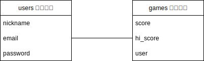

# README

This README would normally document whatever steps are necessary to get the
application up and running.

Things you may want to cover:

* Ruby version

* System dependencies

* Configuration

* Database creation

* Database initialization

* How to run the test suite

* Services (job queues, cache servers, search engines, etc.)

* Deployment instructions

* ...

# アプリケーション名
`殿を守れ`

# アプリケーション概要
`落ちてくる忍者をお城に侵入させないように倒す落ちゲー`

# DB設計

# 画面遷移図

# テーブル設計

## users テーブル

| Column              | Type    | Options                   |
| ------------------- | ------- | ------------------------- |
| nickname            | string  | null: false, unique: true |
| email               | string  | null: false, unique: true |
| encrypted_password  | string  | null: false               |

### Association

- has_one :score

## scores テーブル

| Column              | Type       | Options                         |
| ------------------- | ---------- | ------------------------------- |
| score               | string     | null: false                     |
| hi-score            | string     | null: false                     |
| user                | references | null: false, foreign_key: true  |

### Association

- belongs_to :user

