# README

# アプリケーション名
`殿を守れ`

# アプリケーション概要
`殿様の命を狙って城に侵入してくる忍者を倒すゲーム`

# URL
https://enemyinvasion22222.herokuapp.com/

# ゲームプレーGIF

# 実装予定機能
・制限時間の表示　・点数のランキング機能 
・週毎のランキングリセット機能　・ゲーム難易度の設定 
・BGMの導入　・キャラと落下スピードのランダム化 
・キャラ毎、スピード毎に点数を変えること 
・ゲーム中に離脱しようとする際に「本当に戻りますか？」の 
　ポップアップを表示する機能 
・Twitter・インスタに投稿できるようにロゴクリックでURLへ 
　遷移する機能

# DB設計

# 画面遷移図

# テーブル設計

## users テーブル

| Column              | Type    | Options                   |
| ------------------- | ------- | ------------------------- |
| nickname            | string  | null: false, unique: true |
| email               | string  | null: false, unique: true |
| encrypted_password  | string  | null: false               |

### Association

- has_one :game

## games テーブル

| Column              | Type       | Options                         |
| ------------------- | ---------- | ------------------------------- |
| score               | string     | null: false                     |
| hi-score            | string     | null: false                     |
| user                | references | null: false, foreign_key: true  |

### Association

- belongs_to :user

# Ruby version
`ruby '2.6.5'`